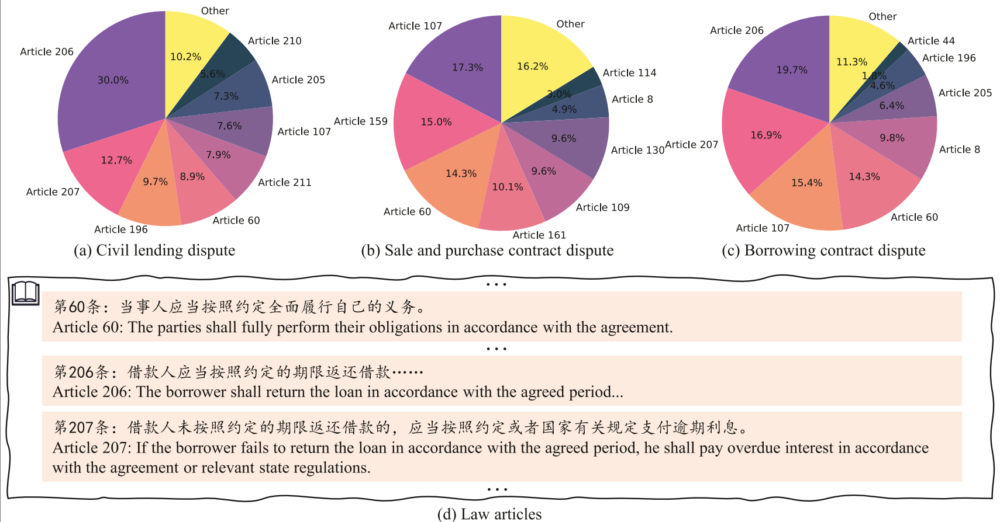

<h1>TML </h1>

Official implementation for ESWA 2024 paper: "**[Topology-aware Multi-task Learning Framework for Civil Case Judgment Prediction](https://www.sciencedirect.com/science/article/pii/S0957417423026052)**"


 <div>
    <a href="https://yuquanle.github.io/tml-homepage/"></a> <a href="https://www.sciencedirect.com/science/article/pii/S0957417423026052">
  
</a>

   </div>

<h5> If you like this work, please give us a star ⭐ on GitHub.  </h2>


<h1>Introduction</h1> 
</div>

 <br>

</h5>
</p> 
<p align="center">
    
<p>
    <p align="justify"> The civil case judgment prediction (CCJP) task involves automatically determining whether the plea of a plaintiff should be supported by analyzing the given civil case materials. However, most existing studies usually rely on inadequate legal essential elements (<i>i.e.</i>, fact descriptions and pleas), and are specifically designed for single-cause scenarios. Consequently, these methods struggle to generalize effectively to real courts, where civil cases involve more complicated legal elements and numerous causes. To resolve the above limitations, we present a novel Topology-aware Multi-task Learning framework, called TML. Concretely, TML adopts the transformer-family pre-trained language models (PLMs) as the backbone to capture the finegrained semantic interactions among various legal elements. To exploit the structural information of the case, we collocate distinct special tokens for each legal element, and then extract the features of the case from different perspectives. Furthermore, to address multiple-cause scenarios, TML incorporates a multi-task learning paradigm to simultaneously predict multiple civil judicial subtasks (<i>i.e.</i>, civil causes, civil law articles and final judgment of pleas). To utilize topological dependencies among subtasks, three parameter-free retrievers are integrated to establish inter-task connections. Extensive experiments are conducted on a real-world dataset, and the experimental results show the effectiveness of our proposed method.</p>

## Code Structure
```
TML/
├── configs
│   ├── KnowAugLawformer_CivilJPConfig.ini
│   └── KnowAugLawformer_CivilJPConfig.py
├── dataset
│   ├── civilJP_dataset.py
│   └── __init__.py
├── figs
│   └── teaserFig.png
├── inferflow
│   └── KnowAugLawformerCivilJP_infer.py
├── models
│   ├── __init__.py
│   └── LawformerCivilJP.py
├── README.md
├── requirements.txt
├── scripts
│   ├── run_infer_KnowAugLawformer_CivilJP.sh
│   └── run_train_KnowAugLawformer_CivilJP.sh
├── tools
│   └── tensorboard_demo.ipynb
├── trainerflow
│   └── KnowAugLawformerCivilJP_trainer.py
├── tree.md
├── tree.sh
└── utils
    ├── CivilJP_utils.py
    ├── __init__.py
    ├── logger.py
    └── utils.py
```

## Datasets
We use the following datasets:
- [CPEE](https://github.com/LiliizZ/CPEE)


## Quick Start

### Training.
```shell
git clone https://github.com/TML.git
cd TML/scripts
./run_train_KnowAugLawformer_CivilJP.sh
```

### Infering.
```shell
./run_infer_KnowAugLawformer_CivilJP.sh
```

## Acknowledgement
Thanks to the open-source projects ([CPEE](https://github.com/LiliizZ/CPEE)) for their works.

## Citation
If you find this work useful, please consider starring 🌟 this repo and citing 📑 our paper:


```bibtex
@article{le2024topology,
  title={Topology-aware multi-task learning framework for civil case judgment prediction},
  author={Le, Yuquan and Xiao, Sheng and Xiao, Zheng and Li, Kenli},
  journal={Expert Systems with Applications},
  volume={238},
  pages={122103},
  year={2024},
  publisher={Elsevier}
}
```
